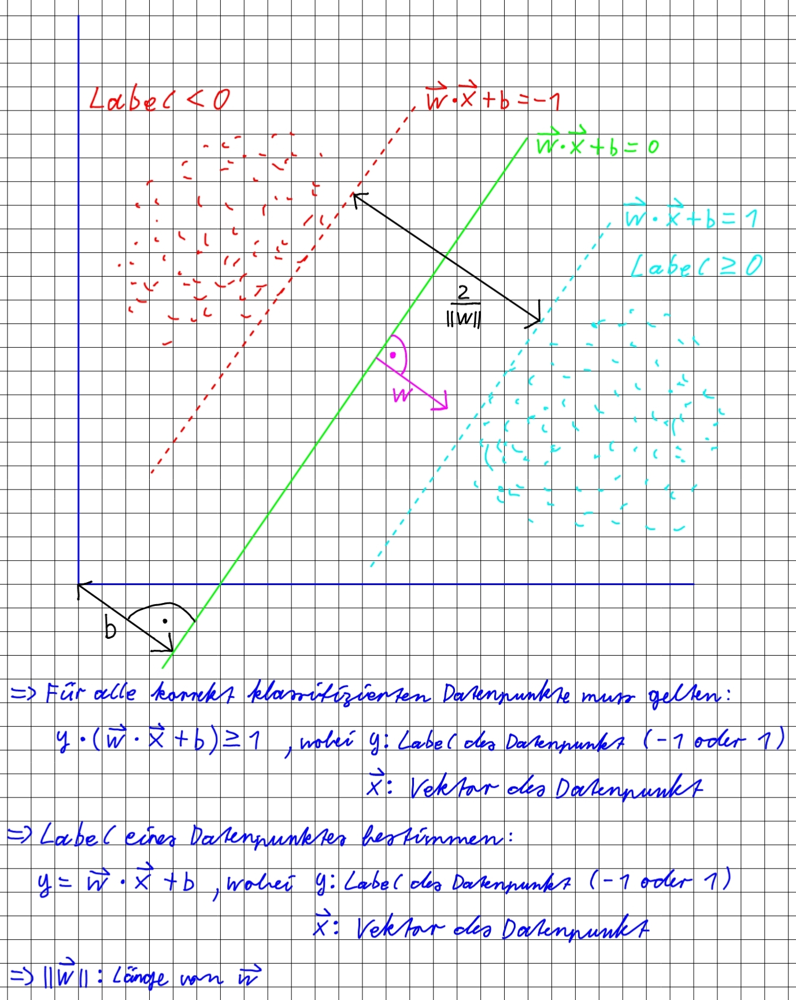

# Support Vector Machine

## SVM Concept

## Quellen
- https://www.youtube.com/watch?v=bM4_AstaBZo
- https://www.youtube.com/watch?v=T9UcK-TxQGw
- https://github.com/AssemblyAI-Examples/Machine-Learning-From-Scratch/blob/main/09%20SVM/svm.py
- https://medium.com/@gallettilance/support-vector-machines-16241417ee6d
- https://medium.com/@kushaldps1996/a-complete-guide-to-support-vector-machines-svms-501e71aec19e
- https://de.wikipedia.org/wiki/Support_Vector_Machine
- https://www.geeksforgeeks.org/using-a-hard-margin-vs-soft-margin-in-svm/
- https://www.tu-chemnitz.de/urz/ittime/documents/Vortrag_Jens_Poenisch_SVM.pdf
- https://c.wgr.de/f/verlage/westermanngruppe-at/dimensionen-mathematik/materialien/06_Vektorrechnung/06_GeometrischeDeutungDesSkalarprodukts/06_06_GeometrischeDeutungSkalarprodukt.html
- https://github.com/CihanBosnali/Machine-Learning-without-Libraries/tree/master/Support-Vector-Machine
- Géron, Aurélien: Hands-On Machine Learning with Scikit-Learn, Keras, and TensorFlow, 2. Auflage, O'Reilly Media, Inc., Kanada 2019
